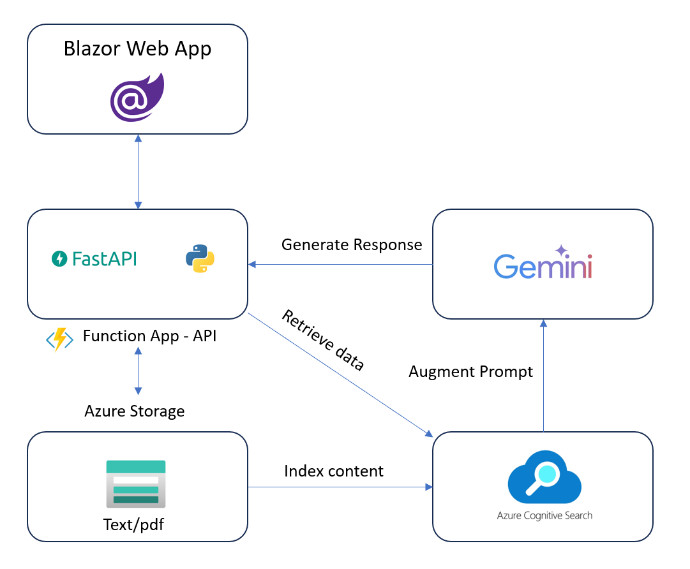

# OmniQ Hub

Welcome to the **OmniqHub** repository, a comprehensive platform integrating various technologies to create a versatile solution. This README provides an overview of the directory structure and the technologies employed within each folder, along with additional information about features, application architecture, Azure account requirements, getting started, project setup, resources, and frequently asked questions.

## Table of Contents

1. [Features](#features)
2. [Application Architecture](#application-architecture)
3. [Azure Account Requirements](#azure-account-requirements)
4. [Getting Started](#getting-started)
    - [Project Setup](#project-setup)
    - [Local Environment](#local-environment)
5. [Resources](#resources)
6. [FAQ](#faq)

# ChatGPT + Enterprise data with Google Gemini Pro and Cognitive Search (.NET)

This sample demonstrates a few approaches for creating ChatGPT-like experiences over your own data using the Retrieval Augmented Generation pattern. It uses Google Gemini Pro Service to access the model, and Azure Cognitive Search for data indexing and retrieval.

The repo includes sample data so it's ready to try end-to-end. In this sample application, we use a fictitious company called Contoso Electronics, and the experience allows its employees to ask questions about the benefits, internal policies, as well as job descriptions and roles.

[RAG Architecture](https://python.langchain.com/docs/use_cases/question_answering/#rag-architecture)

## Features

- **Versatile Functionality**: OmniqHub offers a wide range of features catering to diverse use cases.
- **Integration of Technologies**: The repository seamlessly integrates Python, FastAPI, .NET 8, Microsoft ASP.NET Core Blazor, C#, MudBlazor as Component Library, Microsoft SQL Server, Azure Function with Python, Docker, Azurite emulator for local Azure Storage development, Azure AI Search, Azure Blob Storage, Google Gemini Pro, and LangChain.
- **Scalability**: Designed to scale with your needs, whether it's handling large datasets or expanding functionality.
- Chat and Q&A interfaces
- Explores various options to help users evaluate the trustworthiness of responses with citations, tracking of source content, etc.
- Shows possible approaches for data preparation, prompt construction, and orchestration of interaction between model (ChatGPT) and retriever (Cognitive Search)
- Settings directly in the UX to tweak the behavior and experiment with options (In-progress)

## Application Architecture

OmniqHub adopts a modular architecture leveraging both frontend and backend components. The frontend is built using .NET 8, Microsoft ASP.NET Core Blazor, MudBlazor as Component Library and C#, while the backend utilizes Python with FastAPI and Azure Functions. Microsoft SQL Server serves as the primary database management system, supported by Azure Blob Storage for storing unstructured data. AI capabilities are integrated via Azure AI Search, and additional functionalities are enhanced through Google Gemini Pro and LangChain.

- **User interface** - The application’s chat interface is a [Blazor WebAssembly](https://learn.microsoft.com/aspnet/core/blazor/) application. This interface is what accepts user queries, routes request to the application backend, and displays generated responses.
- **Backend** - The application backend is an [FastAPI](https://fastapi.tiangolo.com/). The backend hosts the Blazor static web application and what orchestrates the interactions among the different services. Services used in this application include:
   - [**Azure Cognitive Search**](https://learn.microsoft.com/azure/search/search-what-is-azure-search) – indexes documents from the data stored in an Azure Storage Account. This makes the documents searchable using [vector search](https://learn.microsoft.com/azure/search/search-get-started-vector) capabilities. 
   - [**Google Gemini Pro Service**](https://ai.google.dev/docs) – provides the Large Language Models to generate responses. [LangChain](https://python.langchain.com/docs/get_started/introduction) is used in conjunction with the Google Gemini Pro Service to orchestrate the more complex AI workflows.

## Demo

<video src="references/OmniQ_Hub_Demo.mp4" width="900" height="300" controls></video>

## Azure Account Requirements

To fully utilize the capabilities of OmniqHub and deploy it seamlessly, you'll need:
- An Azure account with appropriate permissions to provision services like Azure SQL Database, Azure Blob Storage, Azure Functions, and Azure Search.

## Getting Started

### Project Setup

1. Clone the repository locally.
2. Navigate to the desired directory.
3. Set up your development environment according to the instructions provided in the respective README files within each folder.

### Local Environment

To set up OmniqHub locally:
1. Install necessary dependencies specified in the respective README files.
2. Configure environment variables, connection strings, and other settings as required.
3. Run the application locally and test its functionalities.

#### FastAPI
follow these steps to run fastAPI server [fastapi_template](https://github.com/MusaddiqueHussainLabs/fastapi_template)

#### Install-or-update-core-tools
[Core Tools](https://learn.microsoft.com/en-us/azure/azure-functions/create-first-function-vs-code-python#install-or-update-core-tools)

#### Azure Function in python 
follow these steps to run Azure function [Azure Function](https://learn.microsoft.com/en-us/azure/azure-functions/create-first-function-vs-code-python#configure-your-environment)

#### Azurite
Start the Azurite emulator [Azurite](https://learn.microsoft.com/en-us/azure/azure-functions/create-first-function-vs-code-python#start-the-emulator)

#### Azure Blob Storage Explorer
[Storage Explorer](https://learn.microsoft.com/en-IN/azure/storage/storage-explorer/vs-azure-tools-storage-explorer-blobs#overview)

## Resources

For additional guidance and resources, refer to the documentation and tutorials provided by the respective technologies used in this repository.

- [Revolutionize your Enterprise Data with ChatGPT: Next-gen Apps w/ Azure OpenAI and Cognitive Search](https://aka.ms/entgptsearchblog)
- [Azure Cognitive Search](https://learn.microsoft.com/azure/search/search-what-is-azure-search)
- [Azure OpenAI Service](https://learn.microsoft.com/azure/cognitive-services/openai/overview)
- [LangChain](https://python.langchain.com/docs/get_started/introduction)
- [Google AI Studio](https://aistudio.google.com/app/home)
- [`Azure.AI.OpenAI` NuGet package](https://www.nuget.org/packages/Azure.AI.OpenAI)
- [Original Blazor App](https://github.com/Azure-Samples/azure-search-openai-demo-csharp)

## FAQ

**Q: Can I deploy OmniqHub on other cloud platforms besides Azure?**
A: While OmniqHub is primarily designed for Azure, with some modifications, it can potentially be deployed on other cloud platforms.

**Q: How can I contribute to OmniqHub?**
A: Contributions are welcome! Fork the repository, make your changes, and submit a pull request. Be sure to follow the contribution guidelines outlined in the repository.

**Q: Is there a roadmap for future developments of OmniqHub?**
A: The roadmap for OmniqHub's future developments may vary. Stay tuned to the repository for updates and announcements regarding new features and enhancements.

**Q: What support channels are available for troubleshooting and assistance?**
A: For troubleshooting and assistance, you can refer to the documentation provided within the repository or reach out to the community via GitHub discussions or issue tracker.